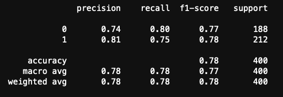

# Model to predict student loan repayment.

A neural network model for Student Loan Repayment will be created using Tensorflow Keras.  
Input data file is in csv format has about 1600 records and 11 features. Predicted value will be *"Credit Ranking"*. Then create the features (X) and target (y) datasets. The target dataset is defined by the *“credit_ranking”* column. The remaining columns define the features dataset.  
Then split the features and target sets into training and testing datasets. Scikit-learn's StandardScaler was used to to scale the features data.  
Tensorflow was used to create a deep neural network model. This model will use the dataset’s features to predict the credit quality of a student based on the features in the dataset. Model will consist of two layers. First hidden layer will be designed to contain 32 neurons (approximately three times number of features in dataset). Second hidden layer will contain 16 neurons (half of first hidden layer). Then the output layer will have just one neuron since y data is a binary dataset (0 or 1). Activation function of *'tanh'* will be used in first hidden layer, *'relu'* was used in second hidden layer. Ouput layer uses *'sigmoid'* activation function.  
Compile and fit the model using the *'binary_crossentropy'* loss function, the *'adam'* optimizer, and the *'accuracy'* evaluation metric.  
Then model was evaluated using the test data to determine the model’s loss and accuracy with the following results:  
*Loss: 0.52168869972229, Accuracy: 0.7749999761581421*  

Then model was exported to a keras file and saved to local drive. Then predictions made on the testing data and save the predictions to a DataFrame and round the predictions to binary results.  

Finally display a classification report with the y test data and predictions.  

